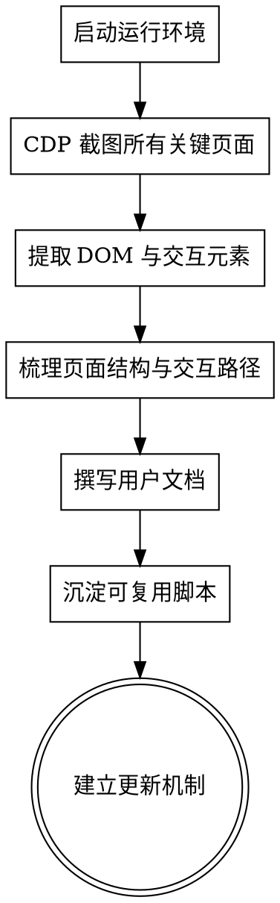

# Product Documentation Skill

## When to Use

Invoke this skill whenever the user wants to:

- 为当前 App 生成面向普通用户的产品说明文档。
- 基于实际运行中的界面截图梳理功能和交互路径。
- 更新已有的用户文档以反映新功能。
- 建立可复用的「运行 → 截图 → 梳理 → 撰写 → 更新」文档流程。

## Anti-Patterns

- **不要只读代码写文档**：必须从实际运行环境或 CDP/浏览器调试中获取界面证据。
- **不要写成技术文档**：避免实现细节、接口定义、数据模型。面向普通用户，讲"这是什么""怎么用""有什么用"。
- **不要一次性写完就丢**：必须按"持续追加"的格式组织，方便后续更新。

## Standard Process



## Phase 1 — 启动运行环境

1. **判断应用类型**：
   - Web 前端（Vite / React / Vue 等）→ `npm run dev` 或 `npm run preview`。
   - Tauri 桌面应用 → 优先启动 `cargo tauri dev`，若太重则启动前端 dev server 作为替代。
   - 移动端 / 模拟器 → 启动对应模拟器并确保可通过 CDP / Safari Inspector 访问 WebView。
2. **确保可访问**：
   - 用 `curl` 或浏览器验证目标 URL 能返回 200。
   - 记录访问地址（如 `http://localhost:5173/index.html`）。
3. **后台保持运行**：
   - 使用 `run_in_background=true` + `disable_timeout=true` 保持 dev server 长期运行。

## Phase 2 — CDP 截图与元素提取

1. **选择工具链**：
   - 推荐 Playwright + Chromium（`--remote-debugging-port=9223`）。
   - 也可以用 Puppeteer、Chrome DevTools Protocol 原生客户端。
2. **编写检查脚本**（参考模板 `scripts/cdp-inspect.js`）：
   - 列出所有需要捕获的视图/路由。
   - 对每个视图执行：
     - 导航或触发视图切换（点击侧边栏、设置 hash、调用全局状态）。
     - 等待渲染完成（建议 ≥ 1.5s，复杂页面 ≥ 3s）。
     - 全页截图保存为 `docs/product-screenshots/NN_view-id.png`。
     - 通过 CDP `Runtime.evaluate` 提取交互元素（按钮、链接、输入框、标签页）。
     - 将元素清单、页面文本、时间戳保存为同名 `.json`。
3. **输出目录结构**：

```
docs/product-screenshots/
├── _summary.json          # 总览：哪些视图已捕获
├── 00_frontstage.png      # 幕前/主界面
├── 00_frontstage.json     # 元素与文本
├── 01_dashboard.png
├── 01_dashboard.json
└── ...
```

4. **质量检查**：
   - 抽查若干截图，确认不是重复内容（文件大小、视觉内容有差异）。
   - 若视图切换未生效，改用更可靠的触发方式（如直接点击 Sidebar 第 N 个按钮）。

## Phase 3 — 梳理功能与交互路径

1. **阅读 `_summary.json` 和各视图的 `.json`**，整理出：
   - 页面名称与核心作用（一句话）。
   - 页面上有哪些按钮/入口。
   - 点击后的预期行为。
   - 空状态与有数据状态的差异。
2. **绘制信息架构**：
   - 全局导航（侧边栏、底部栏、顶部栏）。
   - 各页面之间的关系（从 A 点击什么到 B）。
   - 主要用户流程（创建故事 → 添加角色 → 写场景 → 幕前写作 → AI 续写）。
3. **识别共用组件**：
   - 连接状态提示、登录按钮、更新通知、操作反馈（Toast）。
   - 把这些提取成"全局状态与通知"章节，避免每个页面重复写。

## Phase 4 — 撰写用户指南

1. **文件位置**：`docs/USER_GUIDE.md`（或按项目约定命名）。
2. **文档结构模板**：

```markdown
# {产品名} 用户指南

> 面向普通用户的产品使用说明。本文档基于当前版本界面截图整理，后续功能更新将持续追加。
> 最后更新：YYYY-MM-DD

## 一、产品概览
- 产品定位（一句话）。
- 核心空间/模块划分（如 幕后 vs 幕前）。

## 二、全局导航与共用界面
- 侧边栏/底部栏/顶部栏逐项说明。
- 全局通知、登录、连接状态。

## 三、各页面详解
对每个页面：
- 截图（引用 product-screenshots/）。
- 作用说明。
- 界面元素表格（按钮、入口、状态）。
- 典型操作路径（步骤 1 → 2 → 3）。
- 为什么有用（用户价值）。

## 四、核心流程
- 快速上手的步骤化说明。

## 五、常见状态与通知
- 错误提示、加载中、空状态、成功反馈。

## 六、更新日志区（持续追加）
按时间倒序列出新功能。

## 七、附录：截图清单
表格列出所有截图文件名与对应页面。
```

3. **写作原则**：
   - 用"你"称呼用户。
   - 每个功能都要回答：是什么、怎么点、点完会怎样。
   - 多用表格和列表，少写长段落。
   - 截图必须配简短图注。

## Phase 5 — 沉淀可复用脚本与更新机制

1. **保留检查脚本**：
   - 将 `scripts/cdp-inspect.js` 加入版本控制。
   - 在脚本头部写清楚用途、运行方式、环境变量。
2. **建立更新命令**（可选）：
   - 在 `package.json` 增加 `"docs:screenshots": "node scripts/cdp-inspect.js"`。
   - 增加 `"docs:build": "node scripts/cdp-inspect.js && ..."`。
3. **更新流程标准化**：
   - 后续有新功能时，按以下步骤追加文档：
     1. 在 `cdp-inspect.js` 的 `VIEWS` 数组中补充新视图。
     2. 运行脚本，生成新截图和 JSON。
     3. 在 `USER_GUIDE.md` 的"更新日志区"新增条目。
     4. 在对应章节插入新页面说明。
     5. 更新"附录：截图清单"。
     6. 修改文档顶部的 `最后更新` 日期。

## Checklist

执行本 skill 时，必须逐项确认：

- [ ] 已启动运行环境，且 curl 目标地址返回 200。
- [ ] 已使用 CDP/浏览器调试截取所有关键页面。
- [ ] 每个截图都保存了对应的 `.json` 元素清单。
- [ ] 已抽查截图，确认视图切换正确、无重复。
- [ ] 已梳理信息架构和主要用户流程。
- [ ] 已撰写 `docs/USER_GUIDE.md`，面向普通用户，避免技术细节。
- [ ] 文档中包含"更新日志区"，格式支持持续追加。
- [ ] 已沉淀可复用脚本（`scripts/cdp-inspect.js` 或同类文件）。
- [ ] 已向用户说明如何后续更新文档（运行脚本 + 追加章节 + 改日期）。

## Output Artifacts

完成本 skill 后，应交付：

1. `docs/USER_GUIDE.md` —— 面向用户的说明文档。
2. `docs/product-screenshots/*.png` + `*.json` —— 截图与元素数据。
3. `scripts/cdp-inspect.js` —— 可复用的 CDP 检查脚本。
4. 更新流程说明 —— 让用户知道下次怎么自己更新。
